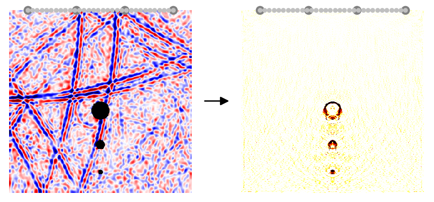

# CuWave

<picture>
  <source media="(prefers-color-scheme: dark)" srcset=".assets/readme-dark.png">
  
</picture>

**CuWave** is a single GPU-accelerated differentiable finite difference wave propagation code.
Possible applications include

<table width="100%">
<tr>
<td valign="middle"><a href="https://www.sciencedirect.com/science/article/pii/S0045782523000166"><strong>nondestructive testing via full waveform inversion</strong></a></td>
<td width="60%" align="right" valign="middle"><picture>
<source media="(prefers-color-scheme: dark)" srcset=".assets/fwi-dark.png">

</picture></td>
</tr>
<tr>
<td valign="middle"><a href="https://doi.org/10.1007/s00158-025-04237-y"><strong>transient acoustic topology optimization</strong></a></td>
<td width="60%" align="right" valign="middle"><picture>
<source media="(prefers-color-scheme: dark)" srcset=".assets/tato-dark.png">

</picture></td>
</tr>
<tr>
<td valign="middle"><a href="https://www.science.org/doi/10.1126/sciadv.aay6946"><strong>analog neural networks</strong></a></td>
<td width="60%" align="right" valign="middle"></td>
</tr>
<tr>
<td valign="middle"><a href="https://opg.optica.org/josab/fulltext.cfm?uri=josab-38-2-496"><strong>transient photonic topology optimization</strong></a></td>
<td width="60%" align="right" valign="middle"><picture>
<source media="(prefers-color-scheme: dark)" srcset=".assets/tpto-dark.png">

</picture></td>
</tr>
</table>

## Documentation
- see the [documentation](docs/Home.md) for how the code works (created together with Claude)
- see [examples](https://github.com/Leon-Herrmann/cuwave/tree/main/examples) for how to apply the code
## Install

```bash
pip install cupy-cuda12x        # or cupy-cuda11x, to match your CUDA
pip install -e .                
```

CuPy must be installed separately because the wheel depends on your CUDA toolkit;
all remaining dependencies are declared in `pyproject.toml`.

PyTorch is optional for the regularization via neural optimization; see [pytorch](https://pytorch.org/get-started/locally/) for the installation. Otherwise it is not needed.
## References

If you use our code for your scientific research, please acknowledge this by referring to the following publication:

_Herrmann, L., Bürchner, T., Kudela, L., Kollmannsberger, S., 2026, **A memory-efficient adjoint method to enable billion parameter optimization on a single GPU in dynamic problems**, Structural and Multidisciplinary Optimization, Volume 69, 52 (2026), DOI: [10.1007/s00158-025-04237-y](https://doi.org/10.1007/s00158-025-04237-y)_
